# Smart Employee & Project Management System

A full-stack web application for managing employees, projects, and tasks, with role-based dashboards for **Admins** and **Employees**. Built with **ReactJS** on the frontend and **Spring Boot 3** on the backend, secured with **JWT authentication**.

---

## Table of Contents

- [Features](#features)
- [Technology Stack](#technology-stack)
- [Project Structure](#project-structure)
- [Database Design](#database-design)
- [Prerequisites](#prerequisites)
- [Getting Started](#getting-started)
  - [1. Clone the Repository](#1-clone-the-repository)
  - [2. Backend Setup](#2-backend-setup)
  - [3. Frontend Setup](#3-frontend-setup)
  - [4. Run with Docker (Optional)](#4-run-with-docker-optional)
- [Default Login Credentials](#default-login-credentials)
- [API Documentation](#api-documentation)
- [API Endpoints Overview](#api-endpoints-overview)
- [Postman Collection](#postman-collection)
- [Testing](#testing)
- [Application Screenshots](#application-screenshots)
- [System Flowchart](#system-flowchart)
- [Bonus Features Implemented](#bonus-features-implemented)
- [Author](#author)

---

## Features

### 🔐 Authentication & Authorization
- User registration (signup) and login with JWT-based authentication
- Role-based access control — **Admin** and **Employee** roles
- Admin approval workflow for new employee registrations
- Change password and profile management
- Audit logging of login/logout and key actions

### 👥 Employee Management
- Add, update, delete and view employees
- Department assignment
- Search, pagination and sorting on the employee list
- Profile photo upload with admin approval

### 📁 Project Management
- Create, update and delete projects
- Assign employees to projects (many-to-many)
- Track project status, priority and deadlines

### ✅ Task Management
- Create and assign tasks to employees within a project
- Update task progress and status
- Add remarks/comments to tasks

### 📊 Dashboards
- **Admin Dashboard** — overall stats for employees, projects, tasks and reports
- **Employee Dashboard** — assigned tasks, completed tasks and upcoming deadlines

### 🔎 Search & Filters
- Search across employees, projects and tasks
- Filter by department, status, priority and date

### 📈 Reports
- Employee-wise task report
- Project progress report
- Pending task report
- Completed task report
- Export to PDF/Excel (frontend, via jsPDF & SheetJS)

---

## Technology Stack

### Backend
 ------------------------------------------------------------------
| **Component** | **Technology**                                   |
| ------------- | ------------------------------------------------ |
| Language      | Java 21                                          |
| Framework     | Spring Boot 3.3.2                                |
| Security      | Spring Security 6 + JWT (`io.jsonwebtoken:jjwt`) |
| Data Access   | Spring Data JPA / Hibernate                      |
| Database      | MySQL 8+                                         |
| Validation    | Jakarta Bean Validation (`@Valid`)               |
| API Docs      | springdoc-openapi (Swagger UI)                   |
| Build Tool    | Maven                                            |
| Utilities     | Lombok                                           |
| Testing       | JUnit 5, Spring Boot Test, Spring Security Test  |
 ------------------------------------------------------------------

### Frontend
 -----------------------------------------------------------------
| **Component**      | **Technology / Library**                   |
| ------------------ | ------------------------------------------ |
| Frontend Framework | React 18 (Vite)                            |
| Routing            | React Router DOM v6                        |
| HTTP Client        | Axios (with JWT interceptors)              |
| Forms & Validation | React Hook Form + Yup                      |
| UI                 | Bootstrap 5, Bootstrap Icons, Lucide React |
| Reports Export     | jsPDF, jspdf-autotable, SheetJS (xlsx)     |
 -----------------------------------------------------------------

### DevOps
- Docker & Docker Compose (MySQL + Backend + Frontend)
- Git & GitHub

---

## 📁 Project Structure

```text
Smart Employee Project Management System/
│
├── employee-project-management-backend/
│   ├── pom.xml
│   ├── Dockerfile
│   └── src/
│       ├── main/
│       │   ├── java/
│       │   │   └── com/
│       │   │       └── epms/
│       │   │           ├── config/
│       │   │           │   ├── SecurityConfig.java
│       │   │           │   ├── DataInitializer.java
│       │   │           │   └── OpenApiConfig.java
│       │   │           │
│       │   │           ├── controller/
│       │   │           │   ├── AuthController.java
│       │   │           │   ├── EmployeeController.java
│       │   │           │   ├── ProjectController.java
│       │   │           │   ├── TaskController.java
│       │   │           │   ├── DepartmentController.java
│       │   │           │   ├── DashboardController.java
│       │   │           │   ├── ReportController.java
│       │   │           │   ├── UserController.java
│       │   │           │   └── AuditLogController.java
│       │   │           │
│       │   │           ├── dto/
│       │   │           │   ├── request/
│       │   │           │   └── response/
│       │   │           │
│       │   │           ├── entity/
│       │   │           │   ├── User.java
│       │   │           │   ├── Employee.java
│       │   │           │   ├── Project.java
│       │   │           │   ├── Task.java
│       │   │           │   ├── Department.java
│       │   │           │   ├── AuditLog.java
│       │   │           │   └── enums/
│       │   │           │
│       │   │           ├── exception/
│       │   │           │   ├── GlobalExceptionHandler.java
│       │   │           │   └── custom/
│       │   │           │
│       │   │           ├── repository/
│       │   │           │
│       │   │           ├── security/
│       │   │           │   ├── JwtUtils.java
│       │   │           │   ├── AuthTokenFilter.java
│       │   │           │   └── UserDetailsServiceImpl.java
│       │   │           │
│       │   │           ├── service/
│       │   │           │
│       │   │           └── EmpProjectManagementApplication.java
│       │   │
│       │   └── resources/
│       │       ├── application.properties
│       │       ├── schema.sql
│       │       └── data.sql
│       │
│       └── test/
│           └── java/
│               └── com/
│                   └── epms/
│                       └── service/
│
├── employee-project-management-frontend/
│   ├── package.json
│   ├── vite.config.js
│   └── src/
│       ├── components/
│       │   ├── Navbar.jsx
│       │   ├── Sidebar.jsx
│       │   ├── ProtectedRoute.jsx
│       │   ├── Loader.jsx
│       │   └── Toast.jsx
│       │
│       ├── context/
│       │   └── AuthContext.jsx
│       │
│       ├── pages/
│       │   ├── Login.jsx
│       │   ├── Signup.jsx
│       │   ├── Dashboard.jsx
│       │   ├── Employees.jsx
│       │   ├── Projects.jsx
│       │   ├── Tasks.jsx
│       │   ├── Reports.jsx
│       │   ├── AuditLogs.jsx
│       │   └── Profile.jsx
│       │
│       ├── services/
│       │   ├── api.js
│       │   └── axiosInstance.js
│       │
│       ├── App.jsx
│       └── main.jsx
│
├── docker-compose.yml
├── Smart_EPMS_Postman_Collection.json
└── README.md
```

## Database Design

The schema implements the following relationships via JPA:

- **User ↔ Employee**: One-to-One (a user account linked to an employee profile)
- **Department ↔ Employee**: One-to-Many (one department has many employees)
- **Employee ↔ Project**: Many-to-Many (employees can be assigned to multiple projects)
- **Project ↔ Task**: One-to-Many (a project has many tasks)
- **Employee ↔ Task**: One-to-Many (an employee is assigned many tasks)
- **User ↔ AuditLog**: One-to-Many (a user generates many audit log entries)

Tables are auto-generated by Hibernate (`spring.jpa.hibernate.ddl-auto=update`) on first run against the `smart_employee_db` MySQL database. Initial seed data is loaded automatically by `DataInitializer` or via `data.sql`.

### Database Schema SQL (`schema.sql`)

```sql
-- Smart Employee & Project Management System (EPMS) Database Schema

CREATE TABLE IF NOT EXISTS users (
    id BIGINT AUTO_INCREMENT PRIMARY KEY,
    first_name VARCHAR(255) NOT NULL,
    last_name VARCHAR(255) NOT NULL,
    email VARCHAR(255) NOT NULL UNIQUE,
    phone VARCHAR(255) UNIQUE,
    password VARCHAR(255) NOT NULL,
    role VARCHAR(50) NOT NULL DEFAULT 'EMPLOYEE',
    account_status VARCHAR(50) NOT NULL DEFAULT 'PENDING',
    age INT,
    salary DOUBLE,
    profile_photo LONGTEXT,
    pending_profile_photo LONGTEXT,
    photo_status VARCHAR(50) DEFAULT 'NONE',
    created_at DATETIME DEFAULT CURRENT_TIMESTAMP,
    updated_at DATETIME DEFAULT CURRENT_TIMESTAMP ON UPDATE CURRENT_TIMESTAMP
);

CREATE TABLE IF NOT EXISTS departments (
    id BIGINT AUTO_INCREMENT PRIMARY KEY,
    name VARCHAR(255) NOT NULL UNIQUE,
    code VARCHAR(100),
    description VARCHAR(255),
    created_at DATETIME DEFAULT CURRENT_TIMESTAMP,
    updated_at DATETIME DEFAULT CURRENT_TIMESTAMP ON UPDATE CURRENT_TIMESTAMP
);

CREATE TABLE IF NOT EXISTS employees (
    id BIGINT AUTO_INCREMENT PRIMARY KEY,
    employee_id VARCHAR(100) NOT NULL UNIQUE,
    first_name VARCHAR(255) NOT NULL,
    last_name VARCHAR(255) NOT NULL,
    email VARCHAR(255) NOT NULL UNIQUE,
    phone VARCHAR(255),
    department VARCHAR(255),
    department_id BIGINT,
    role VARCHAR(255),
    status VARCHAR(50) DEFAULT 'ACTIVE',
    joining_date DATE,
    salary DOUBLE,
    age INT,
    profile_photo LONGTEXT,
    pending_profile_photo LONGTEXT,
    photo_status VARCHAR(50) DEFAULT 'NONE',
    created_at DATETIME DEFAULT CURRENT_TIMESTAMP,
    updated_at DATETIME DEFAULT CURRENT_TIMESTAMP ON UPDATE CURRENT_TIMESTAMP,
    FOREIGN KEY (department_id) REFERENCES departments(id) ON DELETE SET NULL
);

CREATE TABLE IF NOT EXISTS projects (
    id BIGINT AUTO_INCREMENT PRIMARY KEY,
    project_name VARCHAR(255) NOT NULL,
    description TEXT,
    client VARCHAR(255),
    department VARCHAR(255),
    priority VARCHAR(50) DEFAULT 'MEDIUM',
    status VARCHAR(50) DEFAULT 'NOT_STARTED',
    start_date DATE,
    end_date DATE,
    created_at DATETIME DEFAULT CURRENT_TIMESTAMP,
    updated_at DATETIME DEFAULT CURRENT_TIMESTAMP ON UPDATE CURRENT_TIMESTAMP
);

CREATE TABLE IF NOT EXISTS tasks (
    id BIGINT AUTO_INCREMENT PRIMARY KEY,
    task_title VARCHAR(255) NOT NULL,
    description TEXT,
    priority VARCHAR(50) DEFAULT 'MEDIUM',
    status VARCHAR(50) DEFAULT 'PENDING',
    progress_percentage INT DEFAULT 0,
    due_date DATE,
    remarks TEXT,
    employee_id BIGINT,
    project_id BIGINT,
    created_at DATETIME DEFAULT CURRENT_TIMESTAMP,
    updated_at DATETIME DEFAULT CURRENT_TIMESTAMP ON UPDATE CURRENT_TIMESTAMP,
    FOREIGN KEY (employee_id) REFERENCES employees(id) ON DELETE SET NULL,
    FOREIGN KEY (project_id) REFERENCES projects(id) ON DELETE CASCADE
);

CREATE TABLE IF NOT EXISTS project_employees (
    project_id BIGINT NOT NULL,
    employee_id BIGINT NOT NULL,
    PRIMARY KEY (project_id, employee_id),
    FOREIGN KEY (project_id) REFERENCES projects(id) ON DELETE CASCADE,
    FOREIGN KEY (employee_id) REFERENCES employees(id) ON DELETE CASCADE
);

CREATE TABLE IF NOT EXISTS audit_logs (
    id BIGINT AUTO_INCREMENT PRIMARY KEY,
    username VARCHAR(255),
    user_role VARCHAR(100),
    action VARCHAR(255),
    module VARCHAR(100),
    description TEXT,
    timestamp DATETIME DEFAULT CURRENT_TIMESTAMP
);
```

### Database Seed Data SQL (`data.sql`)

```sql
-- Smart Employee & Project Management System (EPMS) Seed Data (data.sql)

-- 1. Departments Seed Data
INSERT INTO departments (id, name, code, description, created_at, updated_at) VALUES
(1, 'Engineering', 'ENG', 'Software engineering and technical development', NOW(), NOW()),
(2, 'Product', 'PRD', 'Product design, roadmap, and strategy', NOW(), NOW()),
(3, 'Design', 'DSG', 'UI/UX design and user experience research', NOW(), NOW()),
(4, 'Marketing', 'MKT', 'Brand growth and digital marketing', NOW(), NOW()),
(5, 'Human Resources', 'HR', 'Talent acquisition and employee engagement', NOW(), NOW())
ON DUPLICATE KEY UPDATE name=VALUES(name);

-- 2. Default Administrator User (Email: admin@gmail.com, Password: Admin@123)
INSERT INTO users (id, first_name, last_name, email, phone, password, role, account_status, age, salary, created_at, updated_at) VALUES
(1, 'Administrator', 'User', 'admin@gmail.com', '9876543210', '$2a$10$8.UnVuG9HHgffUDAlk8qfOuVGkqRzgVymY0v86C1H47.E5uL5v5/2', 'ADMIN', 'APPROVED', 35, 120000.0, NOW(), NOW())
ON DUPLICATE KEY UPDATE email=VALUES(email);

-- 3. Sample Employee Record (Alex Morgan)
INSERT INTO employees (id, employee_id, first_name, last_name, email, phone, department, department_id, role, status, joining_date, salary, age, created_at, updated_at) VALUES
(1, 'EMP1001', 'Alex', 'Morgan', 'alex.morgan@company.com', '9876543211', 'Engineering', 1, 'Senior Full Stack Engineer', 'ACTIVE', '2023-01-15', 85000.0, 29, NOW(), NOW())
ON DUPLICATE KEY UPDATE employee_id=VALUES(employee_id);

-- 4. Sample Project (Smart Employee & Project System)
INSERT INTO projects (id, project_name, description, client, department, priority, status, start_date, end_date, created_at, updated_at) VALUES
(1, 'Smart Employee & Project System', 'Comprehensive enterprise portal for employee lifecycle, project allocations, and task tracking.', 'TechCorp Global', 'Engineering', 'HIGH', 'IN_PROGRESS', '2024-01-10', '2024-06-30', NOW(), NOW())
ON DUPLICATE KEY UPDATE project_name=VALUES(project_name);

-- 5. Assign Employee to Project
INSERT INTO project_employees (project_id, employee_id) VALUES
(1, 1)
ON DUPLICATE KEY UPDATE project_id=VALUES(project_id);

-- 6. Sample Task (Spring Boot Security & JWT Architecture)
INSERT INTO tasks (id, task_title, description, priority, status, progress_percentage, due_date, remarks, employee_id, project_id, created_at, updated_at) VALUES
(1, 'Design Spring Boot Security & JWT Architecture', 'Implement stateless JWT token filter, password encoder, and auth controllers.', 'HIGH', 'COMPLETED', 100, CURRENT_DATE + INTERVAL 5 DAY, 'JWT authentication fully tested and verified.', 1, 1, NOW(), NOW())
ON DUPLICATE KEY UPDATE task_title=VALUES(task_title);
```


---

## Prerequisites

Make sure you have the following installed:

- **Java** 21 or higher (JDK)
- **Maven** 3.9+
- **Node.js** 18+ and **npm**
- **MySQL** 8+ (running locally, or via Docker)
- **Git**

---

## Getting Started

### 1. Clone the Repository

```bash
git clone <your-repository-url>
cd "Smart Employee Project Management System"
```

### 2. Backend Setup

1. Create a MySQL database (or let the app auto-create it):
   ```sql
   CREATE DATABASE smart_employee_db;
   ```

2. Configure your database credentials and mail settings in
   `employee-project-management-backend/src/main/resources/application.properties`:
   ```properties
   spring.datasource.url=jdbc:mysql://localhost:3306/smart_employee_db?createDatabaseIfNotExist=true&useSSL=false&allowPublicKeyRetrieval=true&serverTimezone=UTC
   spring.datasource.username=root
   spring.datasource.password=<your-mysql-password>

   spring.mail.username=<your-smtp-email>
   spring.mail.password=<your-smtp-app-password>

   app.jwt.secret=<a-long-random-secret-key>
   app.jwt.expiration-ms=86400000
   ```
   > ⚠️ Do not commit real credentials/secrets to GitHub. Use environment variables or a `.env`/`application-local.properties` file excluded via `.gitignore` for production use.

3. Build and run the backend:
   ```bash
   cd employee-project-management-backend
   mvn clean install
   mvn spring-boot:run
   ```
   The API server starts at **http://localhost:8080**.

### 3. Frontend Setup

```bash
cd employee-project-management-frontend
npm install
npm run dev
```
The React app starts at **http://localhost:5173** and communicates with the backend at `http://localhost:8080`.

To build a production bundle:
```bash
npm run build
```

### Database Schema SQL (`schema.sql`)

```sql
-- Smart Employee & Project Management System (EPMS) Database Schema

CREATE TABLE IF NOT EXISTS users (
    id BIGINT AUTO_INCREMENT PRIMARY KEY,
    first_name VARCHAR(255) NOT NULL,
    last_name VARCHAR(255) NOT NULL,
    email VARCHAR(255) NOT NULL UNIQUE,
    phone VARCHAR(255) UNIQUE,
    password VARCHAR(255) NOT NULL,
    role VARCHAR(50) NOT NULL DEFAULT 'EMPLOYEE',
    account_status VARCHAR(50) NOT NULL DEFAULT 'PENDING',
    age INT,
    salary DOUBLE,
    profile_photo LONGTEXT,
    pending_profile_photo LONGTEXT,
    photo_status VARCHAR(50) DEFAULT 'NONE',
    created_at DATETIME DEFAULT CURRENT_TIMESTAMP,
    updated_at DATETIME DEFAULT CURRENT_TIMESTAMP ON UPDATE CURRENT_TIMESTAMP
);

CREATE TABLE IF NOT EXISTS departments (
    id BIGINT AUTO_INCREMENT PRIMARY KEY,
    name VARCHAR(255) NOT NULL UNIQUE,
    code VARCHAR(100),
    description VARCHAR(255),
    created_at DATETIME DEFAULT CURRENT_TIMESTAMP,
    updated_at DATETIME DEFAULT CURRENT_TIMESTAMP ON UPDATE CURRENT_TIMESTAMP
);

CREATE TABLE IF NOT EXISTS employees (
    id BIGINT AUTO_INCREMENT PRIMARY KEY,
    employee_id VARCHAR(100) NOT NULL UNIQUE,
    first_name VARCHAR(255) NOT NULL,
    last_name VARCHAR(255) NOT NULL,
    email VARCHAR(255) NOT NULL UNIQUE,
    phone VARCHAR(255),
    department VARCHAR(255),
    department_id BIGINT,
    role VARCHAR(255),
    status VARCHAR(50) DEFAULT 'ACTIVE',
    joining_date DATE,
    salary DOUBLE,
    age INT,
    profile_photo LONGTEXT,
    pending_profile_photo LONGTEXT,
    photo_status VARCHAR(50) DEFAULT 'NONE',
    created_at DATETIME DEFAULT CURRENT_TIMESTAMP,
    updated_at DATETIME DEFAULT CURRENT_TIMESTAMP ON UPDATE CURRENT_TIMESTAMP,
    FOREIGN KEY (department_id) REFERENCES departments(id) ON DELETE SET NULL
);

CREATE TABLE IF NOT EXISTS projects (
    id BIGINT AUTO_INCREMENT PRIMARY KEY,
    project_name VARCHAR(255) NOT NULL,
    description TEXT,
    client VARCHAR(255),
    department VARCHAR(255),
    priority VARCHAR(50) DEFAULT 'MEDIUM',
    status VARCHAR(50) DEFAULT 'NOT_STARTED',
    start_date DATE,
    end_date DATE,
    created_at DATETIME DEFAULT CURRENT_TIMESTAMP,
    updated_at DATETIME DEFAULT CURRENT_TIMESTAMP ON UPDATE CURRENT_TIMESTAMP
);

CREATE TABLE IF NOT EXISTS tasks (
    id BIGINT AUTO_INCREMENT PRIMARY KEY,
    task_title VARCHAR(255) NOT NULL,
    description TEXT,
    priority VARCHAR(50) DEFAULT 'MEDIUM',
    status VARCHAR(50) DEFAULT 'PENDING',
    progress_percentage INT DEFAULT 0,
    due_date DATE,
    remarks TEXT,
    employee_id BIGINT,
    project_id BIGINT,
    created_at DATETIME DEFAULT CURRENT_TIMESTAMP,
    updated_at DATETIME DEFAULT CURRENT_TIMESTAMP ON UPDATE CURRENT_TIMESTAMP,
    FOREIGN KEY (employee_id) REFERENCES employees(id) ON DELETE SET NULL,
    FOREIGN KEY (project_id) REFERENCES projects(id) ON DELETE CASCADE
);

CREATE TABLE IF NOT EXISTS project_employees (
    project_id BIGINT NOT NULL,
    employee_id BIGINT NOT NULL,
    PRIMARY KEY (project_id, employee_id),
    FOREIGN KEY (project_id) REFERENCES projects(id) ON DELETE CASCADE,
    FOREIGN KEY (employee_id) REFERENCES employees(id) ON DELETE CASCADE
);

CREATE TABLE IF NOT EXISTS audit_logs (
    id BIGINT AUTO_INCREMENT PRIMARY KEY,
    username VARCHAR(255),
    user_role VARCHAR(100),
    action VARCHAR(255),
    module VARCHAR(100),
    description TEXT,
    timestamp DATETIME DEFAULT CURRENT_TIMESTAMP
);
```

### 4. Run with Docker (Optional)

A `docker-compose.yml` is provided at the project root, spinning up MySQL, the Spring Boot backend, and the React frontend together:

```bash
docker compose up --build
```

| Service | Container Port | Host Port |
|---|---|---|
| MySQL | 3306 | 3307 |
| Backend | 8080 | 8080 |
| Frontend | 80 | 5173 |

> Update the environment variables in `docker-compose.yml` (DB password, JWT secret, mail credentials) before deploying anywhere beyond local development.

---

## Default Login Credentials

The application seeds a default administrator account on first run:

| Role | Email | Password |
|---|---|---|
| Admin | `admin@gmail.com` | `Admin@123` |

New employee signups require **admin approval** before they can log in.

> 🔒 Change this default password immediately in any non-local/demo environment.

---

## 📖 API Documentation

The REST APIs are documented using **Swagger (OpenAPI 3)**.

**Features**
- Interactive API testing
- Request and response models
- JWT Authorization support
- API endpoint descriptions

**Access**

| Service | Endpoint |
|---------|----------|
| Swagger UI | `http://localhost:8080/swagger-ui/index.html` |
| OpenAPI JSON | `http://localhost:8080/v3/api-docs` |

## API Endpoints Overview

| **Module**         | **Base Path**      | **Key Endpoints**                                                                                                                                                                                                                |
| ------------------ | ------------------ | -------------------------------------------------------------------------------------------------------------------------------------------------------------------------------------------------------------------------------- |
| **Authentication** | `/api/auth`        | `POST /login`, `POST /signup`                                                                                                                                                                                                    |
| **Users**          | `/api/users`       | `GET /profile`, `PUT /profile`, `PUT /change-password`, `GET /pending-registrations`, `PUT /{id}/approve`, `PUT /{id}/reject`, `POST /profile-photo`, `GET /pending-photos`, `PUT /{id}/approve-photo`, `PUT /{id}/reject-photo` |
| **Employees**      | `/api/employees`   | `GET /`, `GET /{id}`, `POST /`, `PUT /{id}`, `DELETE /{id}`                                                                                                                                                                      |
| **Departments**    | `/api/departments` | `GET /`, `POST /`                                                                                                                                                                                                                |
| **Projects**       | `/api/projects`    | `GET /`, `GET /{id}`, `POST /`, `PUT /{id}`, `DELETE /{id}`                                                                                                                                                                      |
| **Tasks**          | `/api/tasks`       | `GET /`, `GET /{id}`, `POST /`, `PUT /{id}`, `PATCH /{id}/progress`, `DELETE /{id}`                                                                                                                                              |
| **Dashboard**      | `/api/dashboard`   | `GET /stats`                                                                                                                                                                                                                     |
| **Reports**        | `/api/reports`     | `GET /employee-tasks`, `GET /project-progress`, `GET /pending-tasks`, `GET /completed-tasks`, `POST /log-export`                                                                                                                 |
| **Audit Logs**     | `/api/audit-logs`  | `GET /`, `POST /logout`                                                                                                                                                                                                          |


All endpoints except `/api/auth/**` require a valid JWT sent as `Authorization: Bearer <token>`.

---

## 📬 Postman Collection

A complete Postman collection is included for testing all REST API endpoints of the **Smart Employee Project Management System (EPMS)**.

**Collection File**

```text
Smart_EPMS_Postman_Collection.json
```

**Included Modules**

- Authentication
- User Management
- Employee Management
- Department Management
- Project Management
- Task Management
- Dashboard
- Reports
- Audit Logs

**How to Use**

1. Import `Smart_EPMS_Postman_Collection.json` into Postman.
2. Start the backend application.
3. Set the `baseUrl` collection variable (default: `http://localhost:8080`).
4. Execute the **Admin Login** request to generate a JWT token.
5. The token is automatically saved to the `bearerToken` variable and used for authenticated requests.

---

## Testing

Unit tests (JUnit 5 + Mockito) are included for the service layer:

```bash
cd employee-project-management-backend
mvn test
```

Covered services: `AuthService`, `EmployeeService`, `ProjectService`, `TaskService`, `ReportService`.

---

## Application Screenshots

1. Login Page
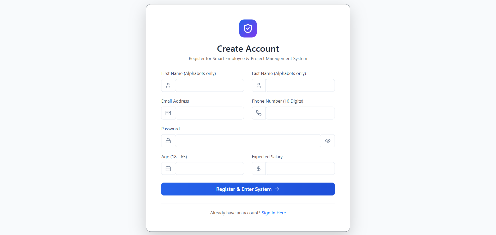
Figure 1: Login Page

2. Signup Page
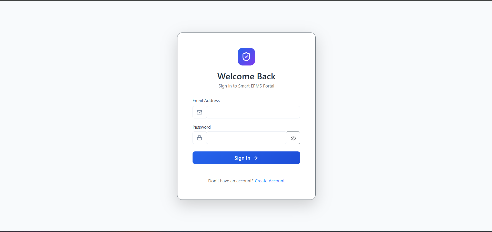
Figure 2: Signup Page

3. Admin Dashboard
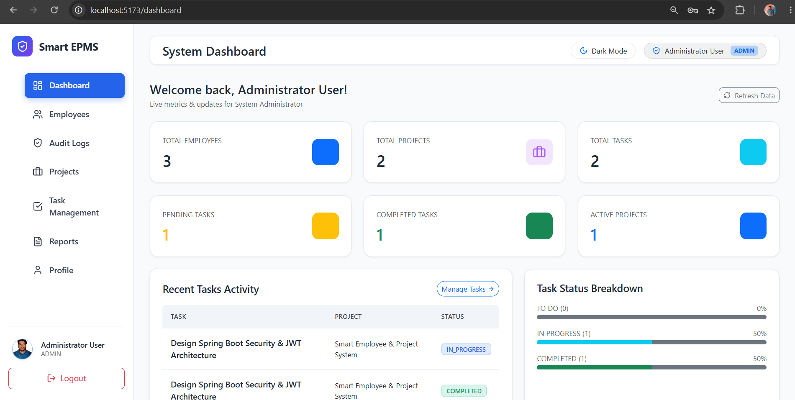
Figure 3: Admin Dashboard

4. Admin Dashboard-Employee Management
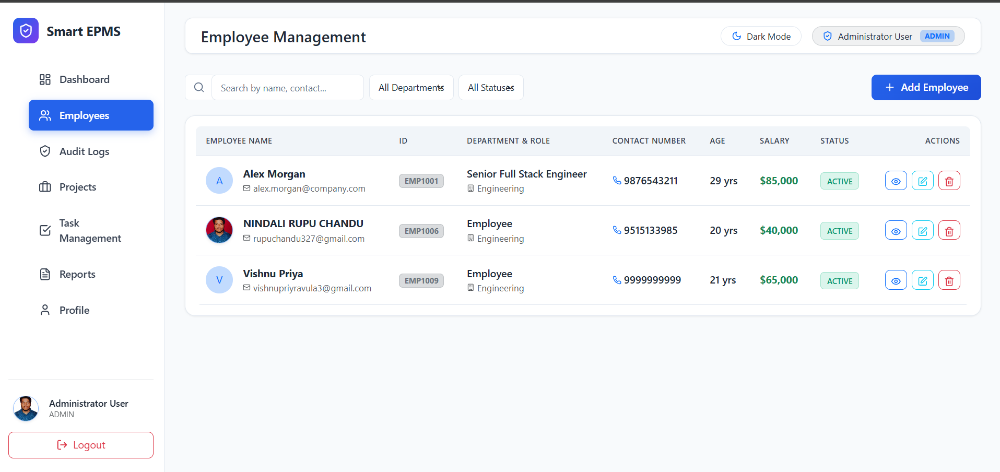
Figure 4: Admin Dashboard-Employee Management

5. Admin Dashboard-Project Management
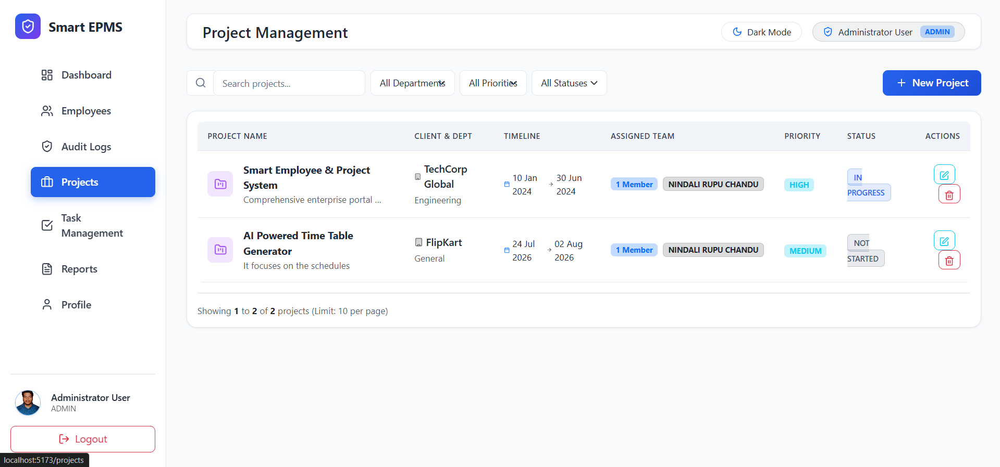
Figure 5: Admin Dashboard-Project Management

6. Admin Dashboard-Task Management
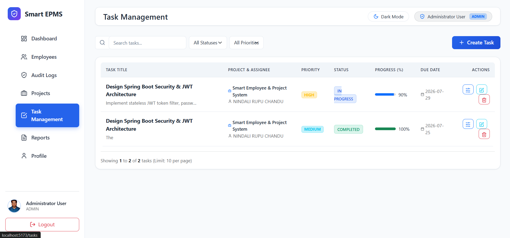
Figure 6: Admin Dashboard-Task Management

7. Admin Dashboard-Audit Logs
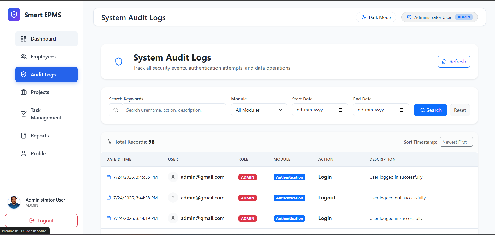
Figure 7: Admin Dashboard-Audit Logs

8. Admin Dashboard-Reports
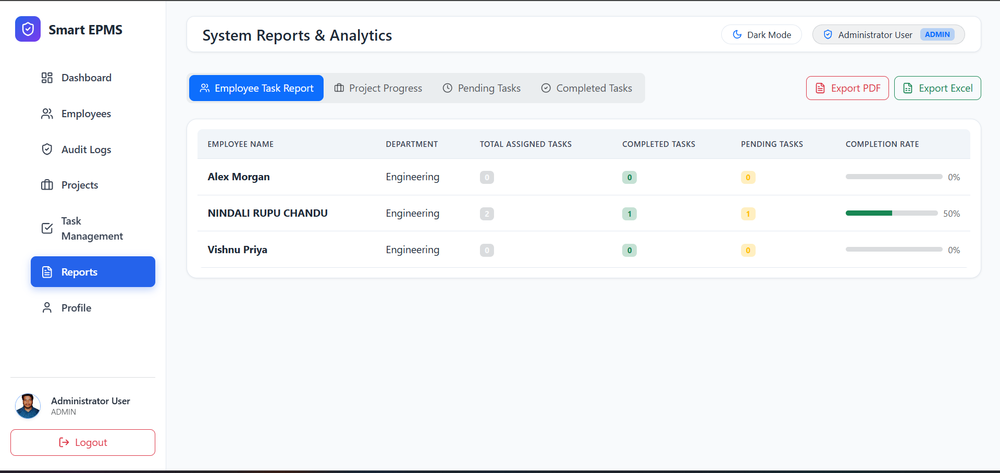
Figure 8: Admin Dashboard-Reports

9. Admin Profile Settings
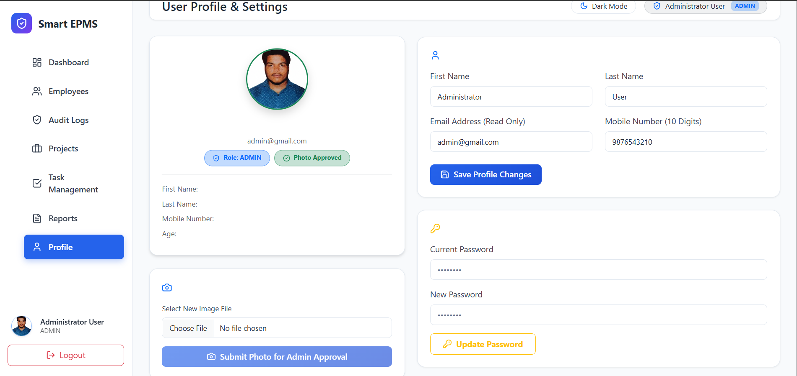
Figure 9: Admin Profile Settings

10. Employee Dashboard
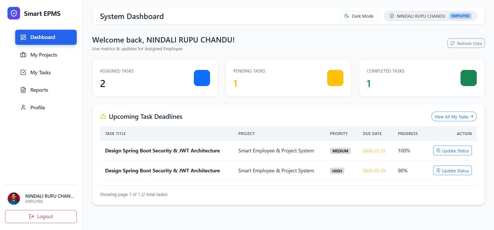
Figure 10: Employee Dashboard

11. Employee Dashboard-Project Management
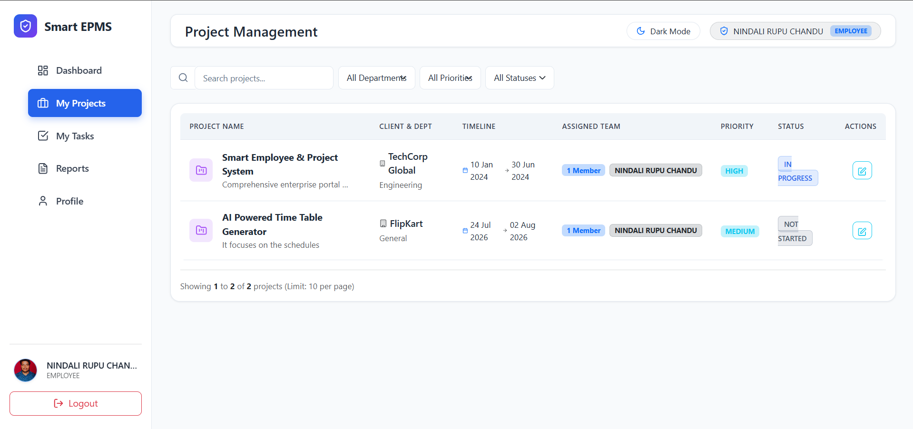
Figure 11: Employee Dashoard-Project Management

12. Employee Dashboard-Task Management
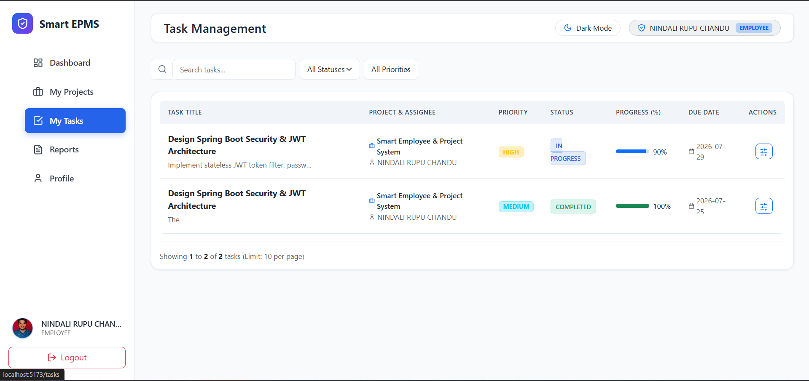
Figure 12: Employee Dashboard-Task Management

13. Employee Dashboard-Reports
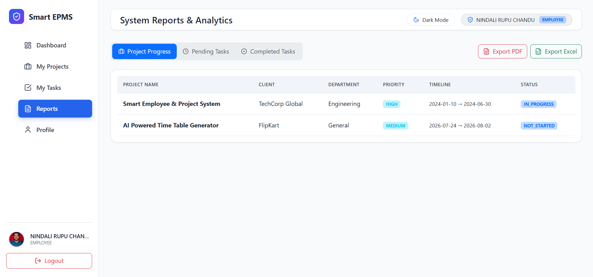
Figure 13: Employee Dashboard Reports

14. Employee Profile Settings
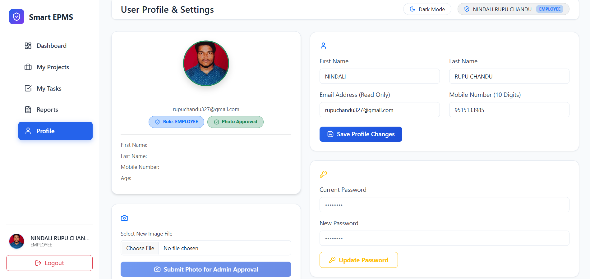
Figure 14: Employee Profile Settings

15. Dark Theme Dashboard
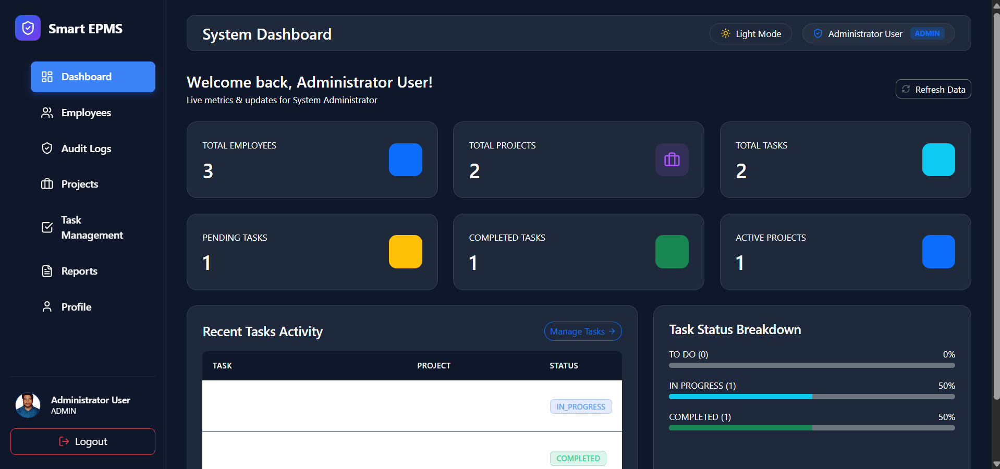
Figure 15: Dark Theme Dashboard

## System Flowchart

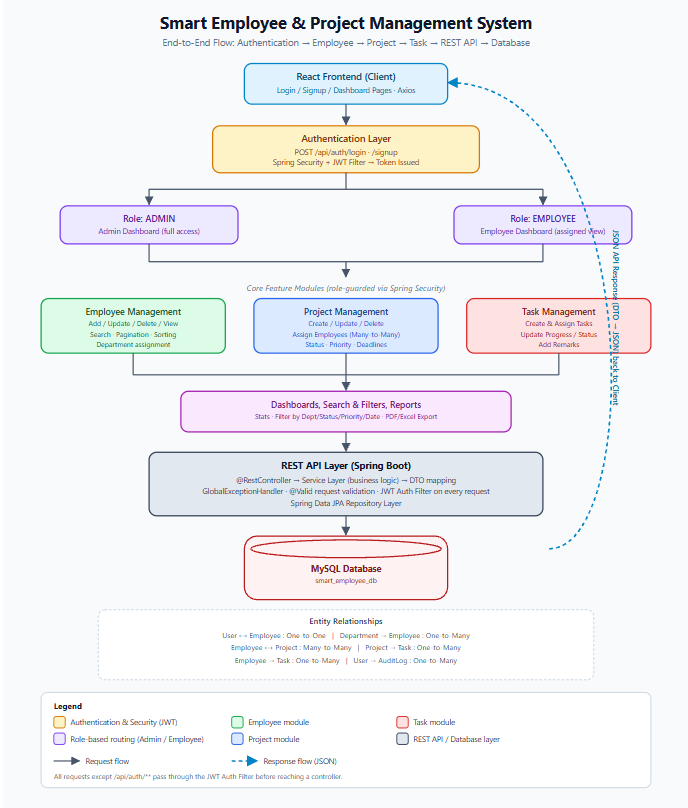

## Bonus Features Implemented

- ✅ Swagger / OpenAPI documentation
- ✅ Docker & Docker Compose (MySQL + backend + frontend)
- ✅ Unit testing (JUnit 5, Mockito)
- ✅ Email notifications (Spring Mail / SMTP)
- ✅ Profile photo upload (with admin approval)
- ✅ Audit logs
- ✅ Dark mode
- ✅ PDF/Excel export is available on the frontend (jsPDF/SheetJS)

---

## Author

Built as a Full Stack capstone project using ReactJS and Spring Boot.
